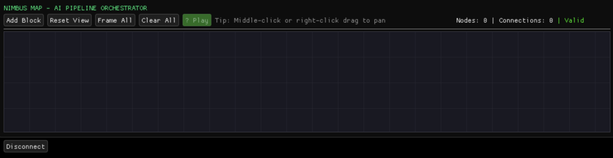

# Droneforge SDK

  
  
  
  

  <strong>Unlock full autonomy on your ELRS drone with real-time computer vision and programmable flight intelligence.</strong>

---

## Table of Contents

- [Overview](#-overview)
- [Getting Started](#-getting-started)
- [Interface Panels](#-interface-panels)
  - [Welcome Screen](#welcome-screen)
  - [Skill-Block Workshop](#skill-block-workshop) 
  - [Video Panel](#video-panel)
  - [Control Settings](#control-settings)
  - [NimbusMap](#nimbusmap)
  - [Link Statistics](#link-statistics)
  - [Flight Controls](#flight-controls)
  - [Performance Metrics](#performance-metrics)
- [Features](#features)
- [API Documentation](#api-documentation)
- [Contributing](#contributing)
- [License](#license)

---

## Overview

Droneforge SDK is a comprehensive development environment for creating intelligent drone control systems. It provides seamless integration with **ELRS (ExpressLRS)** radio systems and powerful AI capabilities including **YOLO object detection** and **depth estimation**.

**Key Capabilities:**
- Real-time YOLO object detection and tracking with over 80 classes
- Monocular depth estimation for spatial awareness
- Visual programming with drag-and-drop blocks
- CRSF protocol integration for ELRS communication
- Advanced PID control for autonomous tracking
- Real-time telemetry and performance monitoring

---

## Getting Started

### Prerequisites
- OpenCV 4.x
- ONNX Runtime (for AI models)

### Installation

1. **Download Release**
   Download the latest release for your operating system from the releases page.

3. **Launch the application**
   Double-click the downloaded executable to launch Droneforge Nimbus.
   If on Linux, run the /droneforge_nimbus.sh

---

## Interface Panels

### Welcome Screen
The entry point of your drone programming.

**Features:**
- **Connection Setup**: Connect your Nimbus USB-C to your computer (should be a proper data cable)
- **Port Selection**: Select CP210x connection from the drop down. Baud rate should stay at 115,200

### Skill-Block Workshop
Your AI development playground for creating reusable drone intelligence.

**Tabs:**
- **Create**: 5-step wizard for scaffolding new AI blocks
  - Define inputs/outputs with type safety
  - Write custom logic in C++
  - Configure parameters with validation
  - Test with sample data
- **Library**: Browse, search, and edit existing blocks
  - Dynamic filesystem sync
  - Version management
  - Block validation and error checking

### Video Panel
Real-time video feed with AI overlay capabilities.

**Features:**
- **Live FPV Video**: High-performance camera feed with optimized rendering
- **AI Overlay**: Real-time YOLO detection boxes and confidence scores
- **Depth Visualization**: Monocular depth estimation overlay
- **Format Support**: Automatic handling of RGB, BGR, and grayscale formats

### NimbusMap
Visual programming interface for orchestrating AI pipelines.

**Capabilities:**
- **Block Library**: Drag-and-drop AI blocks from your workshop
- **Visual Connections**: Type-safe input/output connections with validation
- **Live Playback**: Execute control blocks directly to your drone
- **Parameter Editor**: Configure block parameters in real-time
- **Pipeline Validation**: Automatic error detection and circular dependency checking

### Link Statistics
Monitor your ELRS connection health and telemetry.

**Displays:**
- **Signal Quality**: RSSI, Link Quality, and SNR metrics
- **Real-time Graphs**: Connection stability over time
- **Device Status**: TX/RX connection indicators with ping visualization
- **Reconnection**: Quick reconnect interface when disconnected

### Flight Controls
Compact RC channel monitoring and override capabilities.

**Features:**
- **8-Channel Display**: Vertical bars showing ROLL, PITCH, THROTTLE, YAW + AUX
- **Multi-Input**: Support for gamepads, joysticks, and keyboard control
- **Channel Hardcoding**: Lock specific channels to fixed values
- **Real-time Values**: Live CRSF channel values 

### Performance Metrics
Monitor system performance and collect flight data.

**Metrics:**
- **Thread Performance**: Update frequencies and processing times
- **Input Latency**: End-to-end latency from input to CRSF packet
- **Memory Usage**: Real-time memory consumption tracking
- **Data Collection**: Export flight data for analysis and machine learning

---

## Features

### AI Capabilities
- **YOLO Detection**: 80-class object detection with configurable confidence thresholds
- **Depth Estimation**: Monocular depth perception for spatial awareness
- **Target Tracking**: Autonomous gimbal control with PID-based tracking
- **Custom Models**: Support for custom ONNX models

### Communication
- **CRSF Protocol**: Full ExpressLRS integration
- **Real-time Telemetry**: Battery, attitude, and link statistics
- **RC Channels**: 8-channel support with hardcoding capabilities
- **Auto-discovery**: Automatic ELRS device detection

### User Experience
- **Modern UI**: Clean, professional interface with ImGui
- **Dark Theme**: Eye-friendly dark theme optimized for development
- **Responsive Layout**: Adaptive panel sizing and docking
- **Real-time Feedback**: Live status indicators and progress visualization

### Development Tools
- **Visual Programming**: Node-based AI pipeline creation
- **Block System**: Reusable AI components with versioning
- **Hot Reload**: Real-time block editing and testing
- **Validation**: Comprehensive error checking and type safety

---

## API Documentation

The comprehensive API documentation is currently being developed. It will include:

- **Core SDK Reference**: Complete API documentation
- **Block Development Guide**: Tutorial for creating custom AI blocks  
- **Integration Examples**: Sample projects and use cases
- **Performance Optimization**: Best practices for real-time applications

*Status: Work in Progress - Coming Soon!*

  <strong>Built with ❤️ for the drone development community</strong> 
  Empowering creators to build the future of autonomous flight

 
